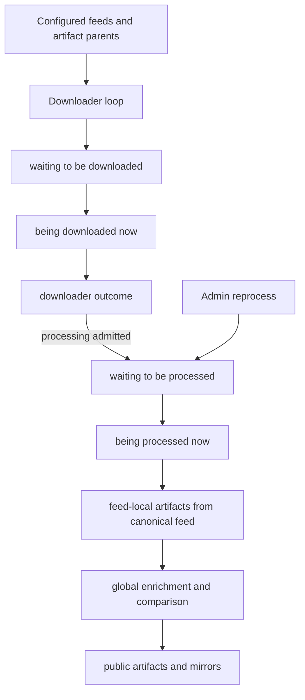
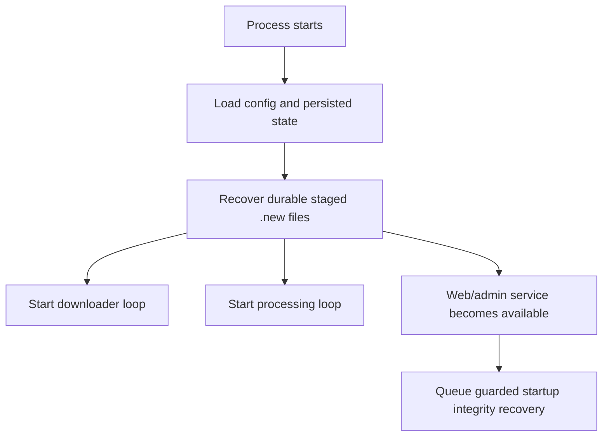
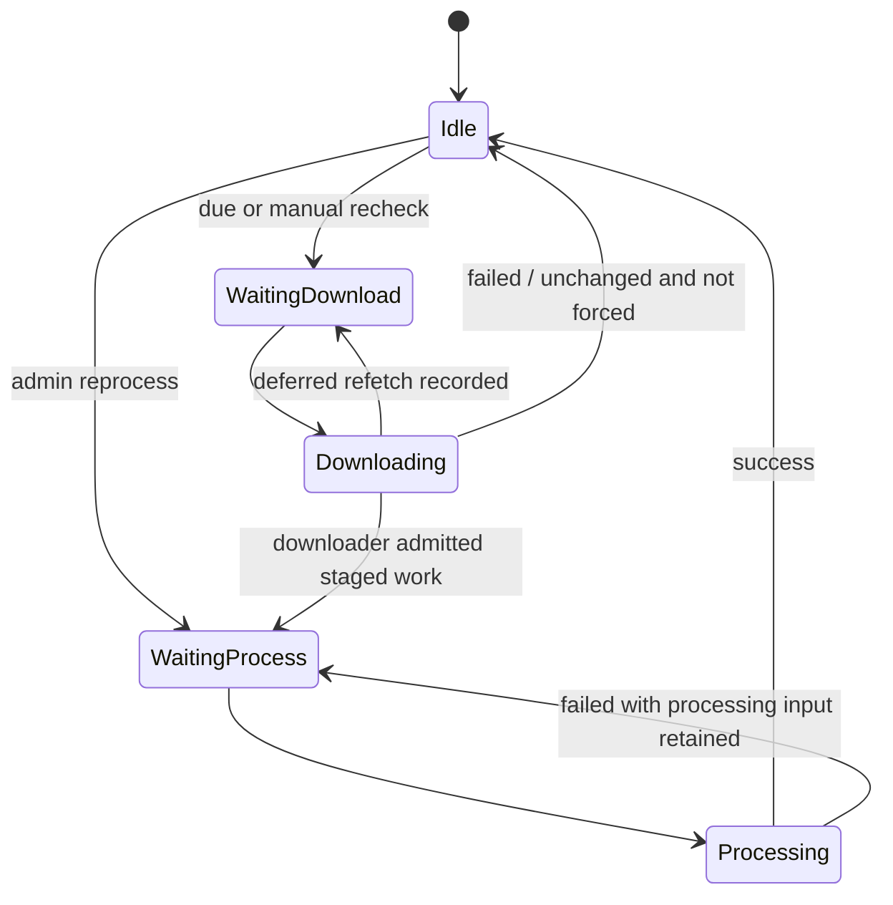

# Pipeline Contract

## Status

This document is normative.

The words **MUST**, **MUST NOT**, **SHOULD**, and **MAY** describe the required
behavior of the product.

## Purpose

The pipeline is responsible for turning upstream inputs, canonical feed bodies,
and supporting datasets into committed feed state, historical evidence,
comparative analysis, and public artifacts.

It MUST do this in a way that:

- isolates slow acquisition/composition work from processing work
- preserves committed state during failures
- supports restart recovery
- gives operators a clear view of what is waiting, running, and blocked

This document owns the choreography between downloader and processing engine.

It is intentionally not the canonical owner of downloader-local rules or
processing-engine-local rules.

Those detailed subsystem contracts live in:

- [downloader.md](downloader.md)
- [processing-engine.md](processing-engine.md)

## Core model

The runtime MUST be split into two loops:

1. a **downloader loop**
2. a **processing loop**

The downloader loop owns acquisition, raw-source retention where applicable,
and canonical feed-body composition. It decides what to obtain from upstream,
what to compose locally, and which feed bodies should enter the processing
queue.

The processing loop owns downstream feed analysis and publication. It consumes
only canonical feed bodies that already exist locally.

The product contract does **not** define a single combined operator-facing
"scheduler" that owns both queues. Automatic cadence evaluation belongs to the
downloader loop. The processing loop is a consumer of already admitted work,
not an autonomous selector of new work.

The runtime MUST treat feed-processing concurrency and heavy-phase concurrency
as separate operational concerns.

When a processing run is cancelled while selected sources are still waiting for
a worker slot, the report SHOULD include an explicit `cancelled` status for
those sources. Cancellation MUST NOT make selected work disappear from the run
accounting as if it had never been considered.

Run cancellation also applies after feed-local processing, during global heavy
phases. Geo, bogon, ASN, critical-infrastructure, comparison, metadata, and
entity-sidecar fan-out MUST stop scheduling new work when the run context is
cancelled and SHOULD return `context.Canceled` promptly after the in-flight
bounded workers settle. Cancellation MUST NOT publish a partial staged web or
entity batch as a successful run.

When multiple in-flight heavy/background worker tasks fail during the same
bounded fan-out, the returned error SHOULD preserve every observed worker
failure, not only the first one. First failure may still cancel new admission,
but already-running worker failures are operator-relevant triage data.

The scheduler runner owns the goroutines it starts for fetch, processing,
staged-work recovery, and download execution. `Runner.Run(ctx)` MUST cancel
those child loops and wait for them to settle before returning, so shutdown and
tests do not race with staged/cache directory cleanup.

Entity artifact background refresh queues are part of the same pipeline
ownership contract. Scheduler feed-update and health-transition refreshes,
startup/reload integrity repair, and operator-triggered entity rebuilds MUST
receive a service/root operation context and propagate it through rebuild,
targeted patch, sidecar fan-out, and publish stages. Once that context is
cancelled, the queue runner MUST stop draining new pending names, wait for
bounded in-flight work to settle, and avoid publishing a partial entity batch as
a successful refresh.

Publication, raw mirror-copy, comparison-preparation, retention-output,
startup-integrity, insight, markdown, and entity-setup loops are required-work
paths, but they MUST still observe their operation context at bounded
checkpoints. A cancelled context MUST return a cancellation error instead of
reporting successful publication or repair. Existing successful output remains
unchanged when the context is live.

Background worker admission MUST be context-aware. If a queued background task
is cancelled before acquiring a worker slot, it MUST finish without acquiring or
releasing a slot and without leaving a stale visible background-task entry.

## Processing model overview

The explicit workflow is:

1. the downloader loop decides what belongs in `waiting to be downloaded`
2. downloader workers move items to `being downloaded now`
3. downloader-stage acquisition or composition produces one downloader outcome
4. only downloader-admitted work enters `waiting to be processed`
5. the processing loop drains that queue into `being processed now`
6. the processing engine finishes downstream work from local canonical
   feed-body state only

The only direct non-downloader admissions into `waiting to be processed` are:

- explicit admin `reprocess`
- integrity-triggered local engine-repair `reprocess` when enough committed or
  staged feed-body state already exists

Critical-infrastructure reference feeds have one extra scheduler rule: if the
current provider-set identity differs from the last successfully published
provider-set marker, the downloader queue MUST force-refresh configured
`use: [critical_infrastructure]` sources. This covers metadata-only config
changes and static-body edits without hardcoding addresses in code.
The provider-set identity MUST be based on configured provider metadata,
provider acquisition/processing-shape config (`url`, `static`, `ipv`, `output`,
`format`, `processor`, `processor_raw`, `attributes`, and typed `critical`
metadata), plus configured `critical_asn_context` entries. When
`critical_asn_context` is configured, the identity MUST also include configured
ASN-provider source config because aggregate payloads may embed ASN-context
matches. It MUST NOT include materialized cache state such as content hashes,
entry counts, unique IP counts, on-disk paths, processed dates, version
counters, or any other value that can fluctuate while the pipeline is running;
otherwise a forced refresh can create a self-sustaining scheduler loop or miss
a config-only processing change.

When the processing engine runs only because the critical provider-set identity
changed, it MUST regenerate critical-overlap artifacts and dependent insights
without forcing unrelated geo, ASN, bogon, or entity-sidecar fan-out. If normal
feed/provider updates are also present, each artifact family keeps its own
role-scoped fan-out rules.
While an engine run is active, the scheduler MUST NOT repeatedly force-enqueue
critical providers solely because the provider-set marker has not been written
yet. The active run owns marker publication; repeated provider-set-drift
downloads during that window waste upstream/API quota and can hammer providers.

When `critical_asn_context` is configured, the critical-overlap writer may read
already-published or staged ASN attribution artifacts to add a secondary
`asn_context` section to the aggregate. ASN provider updates MUST therefore be
included in critical fan-out selection, but broad provider-context feeds remain
excluded from critical-overlap target generation.

Configured default ASN/geolocation providers have a separate drift contract.
If the current default-provider identity differs from the last successfully
published default-provider marker, the scheduler MUST enqueue a processing
rebuild even when no upstream body changed. The default-provider identity MUST
include the selected provider source name and stable public/config metadata
needed to interpret derived artifacts.

When the processing engine runs because default-provider drift exists, it MUST
regenerate feed-local ASN/GEO/bogon/critical comparisons, entity sidecars,
country/ASN indexes and detail pages, homepage/provider-derived summaries, and
insights for all public feeds affected by canonical ASN/GEO provider choice.
After successful publication it MUST write the new default-provider marker so
future loops do not keep rebuilding the same state.

## Terms

### Feed

A processable item that results in a public set or a derivative of a public
set.

### Artifact parent

A downloadable upstream artifact that is not itself a public feed, but from
which one or more child feeds are materialized.

### Provider database

A supporting dataset used to enrich feeds, such as ASN or geolocation data.

### Feed body

The canonical plain-text local input that the processing engine consumes for one
feed.

It is the downloader loop's output and the processing loop's input.

### Staged feed body

A complete durable canonical feed body in `.{ip,net}set.new`, waiting for the
engine to claim it.

### Processing feed body

A claimed in-flight canonical feed body in `.{ip,net}set.processing`.

### Committed feed body

The last committed durable canonical feed body in `.{ip,net}set`.

This is the local source of truth used for rebuilds and for downloader-stage
composition of other synthetic feeds.

### History snapshot

A downloader-owned per-parent retained binary snapshot used only for
history-derivative composition and repair.

Rules:

- the snapshot key is the parent feed body's successful update timestamp,
  encoded as `{unix_timestamp}.set`
- each successful parent update MAY create a distinct snapshot
- snapshots are sparse by observed successful parent updates, not dense by
  calendar day
- the downloader MUST write new native snapshots in the bash-compatible
  timestamped layout
- legacy Go day-bucket files MAY still be accepted as transitional local input,
  but they are not the canonical layout anymore
- history snapshots are downloader-side state, not engine retention artifacts

### Published outputs

Everything the processing engine produces from a feed body, including:

- feed-local artifacts
- public metadata
- comparisons
- enrichment payloads
- insights

### Downloader-stage item

Any item whose next action belongs to the downloader loop, whether that action
is:

- external acquisition
- local composition
- artifact child materialization
- provider-database refresh

## Feed families

The pipeline MUST distinguish at least these families:

The semantic ownership of feed families remains in [feeds.md](feeds.md).
This section defines only how those families participate in runtime flow.

### 1. Plain downloadable feeds

- acquired directly from upstream
- can become due on their own cadence

### 2. History derivatives

- depend on one parent feed
- are downloader-composed immediately after the parent update
- are produced from the fresh parent feed body plus downloader-owned retained
  history snapshots for that parent
- represent the additive union of IPs observed in the parent during the last
  `X` days
- do not own an independent wall-clock cadence
- enter the processing queue only when their downloader-composed body requires
  processing

### 3. Merges

- are downloader-composed on cadence
- are reconstructed from the latest durable local canonical feed bodies of
  their currently enabled sources
- do not fetch their own upstream body directly
- are the only synthetic public feed family that progresses purely because time
  passed
- enter the processing queue only when their downloader-composed body requires
  processing

### 4. Artifact-backed child feeds

- materialized from one artifact parent
- do not download independently
- depend on both their own enable state and their parent artifact state

### 5. Artifact parents

- upstream artifact families that are not themselves public feeds
- appear only in downloader-stage work, never as normal feed rows in the
  processing batch
- refresh on their own cadence and materialize child-local inputs

### 6. Provider databases

- downloadable supporting datasets
- enrich feeds but are not themselves operator-facing feeds in the normal feed
  processing queue model

## Concurrency domains

The runtime MUST distinguish between:

- downloader workers
- feed-processing workers
- heavy-phase workers
- engine-lane workers

Downloader workers execute upstream acquisition and local canonical feed-body
composition.

Feed-processing workers execute the current processing batch over feeds that
already have staged or local inputs.

Heavy-phase workers execute the global fan-out after feed outputs are
committed, including:

- metadata/comparison pair generation
- GeoIP comparison generation
- ASN comparison generation
- bogon comparison generation
- critical-infrastructure reference-feed overlap generation

Heavy-phase concurrency MUST be independently configurable.

If the product chooses an automatic heavy-phase default, that default MUST be:

- bounded
- deterministic
- no lower than the feed-processing worker count

Engine-lane workers execute broad engine-owned operations that are not public
HTTP serving and do not belong to the downloader loop. This includes normal
processing-engine runs, integrity refresh scans, integrity-triggered local
reprocess admission, generated-artifact cleanup, entity artifact repair, entity
refresh, and full entity rebuilds. The engine lane MUST be FIFO for new work at
limit `1`, MUST be bounded by its configured limit at higher values, and MUST
not be acquired by the public/admin web server or watchdog sampling paths.
One `RunOnce` invocation is one engine-lane item; the engine lane admits the
whole processing run, not individual heavy phases inside that run.
The engine-lane item stages all artifacts needed by that run, then releases the
lane before final publication waits. The run remains serialized as
`finalizing`: a later `RunOnce` MUST NOT start until local publication, required
git publication for that run, and cache-persistence admission have completed.
This preserves run-to-artifact/git fidelity while keeping the engine lane
available for unrelated non-run work.

Engine-lane start notifications and shutdown notifications MUST be delivered
outside the lane mutex and with non-blocking send semantics. A queued synchronous
caller with a full or abandoned start channel MUST NOT wedge shutdown,
rescheduling, or later work admission.

Engine-lane callback panics and lane finalization panics MUST be contained.
Callback panics are returned as failed work. Finalization panics MUST mark the
affected item failed, release the active slot, wake the idle waiter if needed,
and allow later queued work to start. Lane shutdown ownership MUST be attached
to at most one service context; duplicate context attachments are observable and
MUST NOT create duplicate shutdown goroutines.

The engine lane is an admission and serialization boundary. Once a broad
operation is admitted, it MAY use its own bounded feed-processing, heavy-phase,
or background fan-out as defined by the relevant subsystem contract.
Each admitted broad operation MUST capture one operation snapshot after lane
admission and before phase execution. That snapshot owns the operation's config,
runtime paths, downloader client, provider caches, runtime ledger cache,
retention policy, and ASN lookup cache until the operation finishes. Successful
configuration reloads replace the generation used by later admissions; they
MUST NOT cause an already-admitted operation to mix old and new config/runtime
paths while staging or publishing artifacts.

## Queue and state model

The operator-facing runtime state MUST expose exactly these four live lists:

1. `waiting to be downloaded`
2. `being downloaded now`
3. `waiting to be processed`
4. `being processed now`

There is only one operator-meaningful processing batch:

- the current batch drained from `waiting to be processed` and being executed by
  the processing loop

The system MAY keep additional internal bookkeeping, but it MUST NOT expose
those internal ledgers as if they were separate operator-facing queue states.

## Queue admission contract

The product MUST keep queue ownership explicit.

Allowed admissions into `waiting to be downloaded`:

- downloader-loop cadence decisions
- admin `recheck`
- operator action such as `run due work now` that asks the downloader loop to
  recompute due work immediately
- restart recovery of a durable staged artifact-parent input such as a DroneBL
  `source.new` file, so child materialization still runs under downloader FIFO
  ownership

Allowed admissions into `waiting to be processed`:

- downloader-stage outcomes that admit processing for a feed
- downloader-originated full reprocess admission after successful provider
  refresh
- restart recovery of an already durable staged or processing feed body that had
  previously been admitted by the downloader stage
- integrity-triggered local engine/output repair that requires reprocessing
  from already available committed or staged feed-body state
- explicit admin `reprocess`

No other runtime path is allowed to enqueue ordinary feed work directly into
`waiting to be processed`.

In particular, non-admin runtime code MUST NOT:

- bypass the downloader loop because a feed "probably needs processing"
- requeue ordinary feeds directly into processing as a substitute for
  downloader-stage failure handling
- treat a downloader-stage composition failure as processing-stage work

## Downloader-stage responsibilities

The downloader loop is the only stage allowed to decide whether a feed has a
new feed body that should be processed.

For every feed family, the downloader loop MUST own these decisions:

- how to obtain or compose the next feed body
- whether the result is `downloaded`, `same`, `not_modified`, `empty`,
  `failed`, or another downloader-defined status from [downloader.md]
- whether that outcome should enqueue the feed for processing

The processing engine MUST NOT repeat these freshness decisions for a feed that
already entered `waiting to be processed`.

### Downloader-stage work

The downloader loop MUST handle:

- plain feeds
- history derivatives
- merges
- artifact parents and their child materialization
- provider databases

Restart recovery MUST preserve that ownership. If startup finds a durable
staged artifact-parent input, recovery MUST enqueue the artifact parent as
downloader-stage work. It MUST NOT materialize artifact children directly from
startup code or enqueue the children directly into processing. For the current
DroneBL artifact family, recovered `source.new` state therefore enters
`waiting to be downloaded` as recovered artifact work and only the downloader
worker may materialize child-local inputs.

## Startup contract

Startup MUST do only the work required to make the service operational and to
recover restartable staged work.

Startup MAY:

- load configuration
- load persisted state
- create required directories
- reconcile cheap configuration-derived metadata
- recover durable staged inputs
- start web/admin serving
- queue or run guarded integrity recovery outside the listener startup
  critical path

Startup MUST NOT block service availability on expensive historical analytics,
including:

- full historical ledger rescans
- full snapshot-history rescans
- global rotation or cadence recomputation

## Startup and recovery flow

## Automatic downloader selection

The downloader loop is the only automatic selector of due work.

The detailed downloader-local rules for:

- cadence margins
- hard-failure retry/backoff
- dirty-item coalescing
- downloader result statuses
- downloader status-specific admission behavior

are owned by [downloader.md](downloader.md).

Pipeline-level requirements are:

- an item that has never been checked is due immediately
- automatic due work enters only `waiting to be downloaded`
- manual `recheck` bypasses automatic waits
- only downloader-stage admission can ordinarily move new work into
  `waiting to be processed`
- successful provider-dataset refresh MAY admit a full reprocess wave that uses
  existing local feed bodies

## Staged handoff contract

The downloader-to-engine handoff MUST use durable staged canonical feed bodies.

Rules:

- `.tmp` is incomplete scratch state
- `.new` is complete, durable, restart-recoverable staged state written only by
  the downloader
- `.processing` is engine-claimed in-flight state
- committed `.{ip,net}set` files are the authoritative local truth

The downloader MUST be able to write a fresh `.new` while the engine is
processing an older `.processing` body for the same feed.

The detailed write and promotion semantics are owned by [feeds.md](feeds.md),
[downloader.md](downloader.md), and [processing-engine.md](processing-engine.md).

## Family routing rules

The pipeline MUST route feed families like this:

### Plain feeds

- downloader fetches the source material
- downloader retains raw `.source` for debugging when applicable
- downloader stages the next feed body
- downloader decides whether processing is admitted

### History derivatives

- parent update triggers downloader recomposition
- downloader uses the fresh parent feed body plus the parent's retained history
  snapshots newer than the parent feed body's own `current_update_time - window`
  cutoff
- missing or corrupt snapshots are a downloader-side recovery problem that MUST
  target the parent feed, not derivative processing

### Merges

- merge cadence or explicit `recheck` triggers downloader recomposition
- downloader reconstructs the merge from the latest durable local canonical
  feed bodies of currently eligible additive source feeds and enabled
  subtractive source feeds with usable durable local bodies
- downloader composes merges as `union(additive inputs) - union(subtractive
  inputs)`
- a missing enabled additive or subtractive merge input is a downloader-stage
  failure, not processing-stage work
- archived, unmaintained, or currently failing subtractive source feeds MUST
  still be applied when their durable local canonical body exists. Skipping a
  configured subtraction because its health is old would broaden the merge
  output.

### Artifact parents and children

- artifact parents refresh on their own cadence
- parent refresh stages the artifact and materializes child-local input
- child `recheck` or `reprocess` uses existing child-local input only
- if child-local input is missing, recovery MUST target the parent artifact

### Provider datasets

- provider refresh remains downloader-stage work
- provider datasets MAY appear in downloader-stage queues
- provider datasets do not appear as normal feed entries in processing queues
- successful provider refresh MAY admit a full feed reprocess wave for artifact
  families that depend on that provider role, without any new feed download
- provider fan-out MUST be role-scoped: a critical-infrastructure reference
  refresh rebuilds critical-overlap artifacts, but MUST NOT by itself force
  unrelated GeoIP, ASN, bogon, or entity sidecar artifacts to rebuild
- provider-database-only processing runs MUST expose the affected entity refresh
  targets separately from normal updated feeds, because provider database
  sources are not public feed updates
- if multiple provider updates land while a full reprocess wave is already
  queued or running, the product MAY coalesce them into one effective wave, but
  it MUST guarantee that at least one full reprocess runs after the latest
  successful provider update
- provider-triggered feed reprocess MAY leave country/ASN entity pages
  eventually consistent across actors, but the entity refresh work MUST be
  visible to operators and bounded by background-maintenance concurrency
- ordinary feed-update processing SHOULD precompute pending per-feed
  entity sidecars while provider data is already loaded; the later background
  entity refresh MUST consume those pending sidecars instead of repeating
  range attribution work
- if a full country/ASN entity artifact rebuild is already queued or running,
  foreground processing MUST NOT also precompute and publish pending per-feed
  entity sidecars. It MUST instead report the same affected entity refresh
  targets so the existing changed-feed refresh queue can repair them after the
  full rebuild settles.
- pending per-feed entity sidecar generation is heavy foreground
  work and MUST expose operation/byte counters sufficient to show feed count,
  source ranges, provider segments, ASN lookups, and emitted country/ASN rows
- ordinary feed-update and health-transition country/ASN entity refresh
  requests MUST coalesce repeated feed names while earlier refresh work is
  queued or running; the scheduler MUST NOT create one serial background task
  per tick or completed processing batch when the same feed target is already
  pending
- queued country/ASN entity refresh work that mutates private or public entity
  artifacts MUST stage expensive read/build/write work outside the
  entity-artifact publish lock, then acquire the lock, revalidate the committed
  entity-artifact generation, and publish only when the staged batch still
  matches the current generation. If another entity mutation published first,
  the stale staged batch MUST be discarded and rebuilt instead of being
  published over newer committed artifacts.
- ordinary feed-update entity refresh MUST rebuild selected country/ASN actor
  details from the merged committed-plus-pending per-feed sidecar set. The
  committed country/ASN actor JSON sidecars are derived outputs, not canonical
  patch-state inputs, and ordinary refresh MUST NOT decode one actor JSON file
  per affected actor just to apply a feed delta.
- ordinary and full entity refresh MUST keep explicit committed per-feed
  sidecars for every entity-eligible public-output feed, including feeds whose
  current country/ASN contribution arrays are empty. Empty contribution state is
  canonical data, not an absent file.
- ordinary feed-update entity refresh MUST rebuild only actors whose per-feed
  contribution actually changed; unchanged actor contributions MUST NOT trigger
  cosmetic rewrites
- if a surgical entity refresh requires a pending per-feed entity sidecar that
  is missing or malformed, it MUST surface the fallback and use bounded repair
  or full-rebuild recovery rather than spinning, silently retrying, or leaving
  corrupted entity artifacts in place
- when a surgical entity refresh sees missing committed per-feed sidecars for
  multiple feeds in one batch, it MAY reuse a completed country/ASN aggregate
  feed-presence scan for that batch. It MUST still trigger the same full-rebuild
  fallback when any existing aggregate references a feed whose committed
  sidecar is missing, and it MUST NOT cache an incomplete scan that stopped
  early after finding a referenced feed.
- entity artifact publish batches MUST maintain a durable internal feed-presence
  index generated from the committed/staged feed sidecar set. Surgical entity
  refresh MUST consult this index before falling back to country/ASN actor
  sidecar scans when a committed per-feed sidecar is missing. A missing,
  malformed, oversized, or incompatible index MUST NOT hide a required
  full-rebuild fallback; it only permits the older bounded scan fallback.
- bootstrap and admin entity-integrity checks MUST require the durable
  feed-presence index for the current entity artifact version. A matching
  `lib/entities/version` marker without a readable feed-presence index is a
  partial entity surface and MUST force a full rebuild.
- if an existing committed per-feed entity sidecar uses an older
  membership-only format without contribution counts, the product MAY read it
  for migration detection, but ordinary surgical refresh MUST fall back to
  bounded repair or full rebuild instead of applying incomplete deltas
- repair paths that intentionally verify or refresh existing actor JSON MAY
  compare rebuilt actor sidecars with committed actor sidecars and skip
  private/public JSON rewrites when the actor is semantically unchanged. If
  freshness metadata is needed to prevent a later false-positive integrity
  repair, metadata-only touch updates are preferred over rewriting identical
  JSON bodies. Those touch updates MUST be queued in the publish batch and
  applied during the serialized publish step, not applied directly to live
  files during staging.
- entity feed sidecar, actor JSON sidecar, public detail JSON, and entity index
  rewrites in entity refresh, repair, and full rebuild paths MUST use bounded
  streaming writers when generating staged JSON. They MUST NOT call whole-buffer
  pretty JSON marshaling for large entity payloads because that can stall the
  daemon under cgroup memory pressure and starve web-serving watchdog
  heartbeats.
- entity integrity MUST NOT treat a country/ASN actor sidecar as stale solely
  because a related feed sidecar has a newer mtime; unchanged actor
  contributions are intentionally not rewritten, so mtime-only dependency
  checks create broad false repair plans
- the admin/operator surface MUST offer an explicit way to queue a full
  country/ASN entity rebuild from scratch as visible background work

## Processing loop contract

The processing loop runs on a configurable cadence and MUST also wake
immediately for explicit actions that enqueue processing work, including:

- manual `reprocess`
- completion of downloader-stage work that admitted feeds into processing
- restart recovery of already durable staged or processing feed bodies
- successful provider-database refresh that admitted a full reprocess wave

When it runs, it MUST:

1. take a stable snapshot of `waiting to be processed`
2. mark those items as the current processing batch
3. claim `.new` work into `.processing` as each feed starts
4. execute them in the required processing order
5. publish resulting outputs and secondaries from the canonical feed body being
   processed
6. clear the batch

If the queue is empty, the loop MUST do nothing.

Ordinary downloader-admitted processing work MUST NOT be treated as explicit
operator or repair reprocess intent. If a scheduled processing batch yields no
successful feed updates and no independent database, provider-default,
critical-provider, integrity-repair, or operator-reprocess reason exists, the
engine SHOULD avoid global heavy publication because no new public truth can be
produced by that batch.

The processing loop MUST NOT reject a queued feed merely because its feed body
matches the previous feed body or the previous canonical output.

The processing loop MUST NOT:

- compute downloader due work
- decide which feeds belong in `waiting to be downloaded`
- perform downloader-stage acquisition or synthetic feed composition
- invent new ordinary feed admissions into `waiting to be processed` other than
  executing explicit admin `reprocess` or integrity-triggered local engine
  repair

## Processing order

Within one processing batch, the order MUST be:

1. normal feeds
2. history derivatives
3. merges, ordered by increasing configured dependency count

This ordering exists for deterministic operator-visible execution and
publication.

It MUST NOT be interpreted to mean that the processing engine composes history
derivatives or merges during the batch.

## Processing execution contract

Once a feed has been admitted, the processing loop MUST hand it to the
processing engine as local-only work over staged, processing, or committed
canonical feed-body state.

The detailed analyze/finalize/enrichment/comparison/insight semantics are owned
by [processing-engine.md](processing-engine.md).

Pipeline-level requirements are:

- the engine MUST NOT fetch upstream source material
- the engine MUST NOT synthesize history derivatives or merges
- the engine MUST NOT skip admitted work because the feed body "looks the same"
- provider-triggered and admin/integrity reprocess runs use existing local feed
  bodies only
- peer-facing comparison and insight artifacts MUST reflect the latest known
  settled state once the required reprocessing completes

Pairwise comparison generation MAY keep an internal cache-dir ledger keyed by
the exact current feed pair, normalized content hashes, and comparison algorithm
version. Incremental comparison runs MAY reuse a ledger entry only when both
current normalized content hashes match the recorded pair. Ledger hits MUST
still regenerate peer rows from current feed metadata, category, and lineage so
metadata-only catalog changes are reflected without recomputing exact overlap.
Ledger misses that touch an updated feed MUST compute exact overlap or the
normal cheap skip result. Ledger misses for pairs where neither feed was updated
MAY be skipped during an incremental run only after a valid ledger was loaded;
those pairs are not republished from missing state.

Exact overlap work for retained comparison candidates SHOULD be delegated to
the standalone `pkg/iprange` batched source-pair comparison API instead of
engine-local pair loops. Engine code may still own domain policy such as
updated-feed filtering, ledger reuse, content-hash checks, metadata/lineage row
construction, and cheap skip filters, but reusable range-source comparison
algorithms belong in `pkg/iprange`.

For incremental runs, when an exact comparison candidate has exactly one
updated side, the engine SHOULD orient the `pkg/iprange` source pair so the
updated feed is the comparison driver while preserving the original output pair
identity. Exact comparison candidates SHOULD be split into bounded driver
batches so admin active-operation progress advances during long metadata
comparison phases.

The comparison-pair ledger is an internal, drop-safe optimization. A missing,
malformed, oversized, incompatible, or unwritable ledger MUST NOT block public
artifact publication and MUST NOT change public comparison semantics. Missing,
malformed, oversized, or incompatible readable ledger state MUST force a full
pair rebuild before publication, so an incremental run cannot publish or persist
a partial replacement ledger. After each comparison publication attempt, the
engine SHOULD atomically replace the ledger with entries for the current feed set
represented by retained hits and fresh computations when a valid ledger exists,
or by the full current pair set when the ledger is absent or untrusted.
Full/global comparison runs MUST ignore previous ledger contents for correctness
and compute the current pair set directly.
When a legacy JSON comparison-pair ledger is used as an upgrade input, the
successful v2 binary ledger write MUST remove the legacy JSON file. Leaving the
old JSON file behind is not allowed because it can be reused later if the v2
cache is missing or untrusted.

## Publication contract

Committed feed outputs and public artifacts MUST only be updated from complete
inputs and complete derived results.

Publication MUST preserve this order:

1. stage new feed bodies
2. claim admitted `.new` feed bodies into `.processing`
3. process the batch from `.processing` or committed feed bodies, and write
   successfully finalized normal feed bodies to their committed canonical files
4. stage/update public artifacts and mirrors from the same successful engine
   run, including markdown page artifacts alongside JSON artifacts
5. promote successful supporting staged inputs, such as provider archives and
   artifact-parent source archives, before public artifact publication
6. apply the logical mtimes required by producer contracts to staged public
   artifacts
7. publish the staged public artifact tree during run finalization outside the
   engine lane
8. when configured, sync generated publication files to Git with bounded
   subprocess deadlines
9. save the updated cache state from a post-publication snapshot

Publication MUST preserve the integrity timestamp contract. Files written into
staging directories may temporarily have filesystem write mtimes, but before
they become committed publication data the publishing path MUST set or preserve
the logical mtime assigned by the producer. Public artifact freshness MUST NOT
depend on the instant a staged file was renamed into the live tree.

Git sync is an optional mirror/update step after local publication. Git add,
diff, commit, push, and auto-maintenance subprocesses MUST be bounded by the
configured git publication timeout. A timeout is a publication-run failure that
operators can see and retry, but it MUST NOT corrupt or roll back completed
local artifact publication. Git publication MUST be serialized through a
dedicated one-slot FIFO so background entity refreshes and full processing runs
cannot run overlapping git subprocesses.

When a staged public or entity artifact is byte-identical to the existing live
artifact, the publishing path MAY keep the live file in place and update its
mode, ownership, and logical mtime instead of replacing it. This optimization
MUST be observably equivalent to replacement: the live path, content,
permissions, owner, and producer-assigned mtime must match the staged artifact
after publication. If byte comparison cannot be completed safely, publication
MUST fall back to the normal replacement path.

Public and entity publish batches MAY also carry metadata-only touch intents
for existing live artifacts when the producer has proven the content is already
current but the logical mtime should advance. Such touch intents are publish
operations. They MUST NOT mutate live files while the producer is still staging
work, and they MUST obey the same context, permission, ownership, and
serialization rules as normal staged artifact publication.

Feed-scoped public artifact producers MAY avoid creating a staged replacement
only when the existing target artifact is already equivalent to the artifact
that would be produced: identical bytes, generated-file permissions, and the
same producer-assigned logical mtime. If ownership correction is configured or
any equivalence check cannot prove the artifact is already current, producers
MUST fall back to normal staging and publication.

When raw redistributable feed files are mirrored to `runtime.web_dir_for_ipsets`,
the mirror copy path MAY keep an existing mirror file in place when the
committed canonical feed file is byte-identical. It MUST still apply the
generated-file mode, configured owner, and canonical feed file mtime. If
comparison cannot prove identity, the mirror copy path MUST fall back to the
normal temporary-copy-and-rename path.
The mirror copy path MUST honor the current publish context during identity
comparison and stream copying; cancellation MUST remove temporary copy files and
MUST NOT replace an existing destination with a partial file.

If batch processing fails before publication:

- staged `.new` and claimed `.processing` inputs MUST remain available for
  restart recovery as appropriate
- if a successful feed body was already finalized into committed state but
  public publication did not complete, integrity checks MUST be able to detect
  the missing or stale public artifacts and queue local reprocessing from
  committed state

## Restart recovery contract

On restart:

- incomplete `.tmp` files MAY be discarded
- durable `.new` files MUST be claimed into `.processing`
- durable `.processing` files MUST be treated as unfinished engine work
- unfinished work MUST be re-queued for processing or parent recovery as
  appropriate

This ensures that a kill or crash after download completion but before final
promotion does not lose work or produce silent inconsistency.

## Manual operations

### Recheck

`recheck` means:

- run the downloader stage now
- queue processing even if the downloader concludes the feed body is `same` or
  `not_modified`
- for raw-source feeds, manual `recheck` MUST reparse the retained raw source
  and restage the canonical feed body when that is required to heal stale local
  canonical state; it MUST NOT keep serving a previously misparsed committed
  body just because upstream bytes are unchanged
- for merges, this means recomposing the merge now
- for history derivatives, this means recomputing the derivative body from the
  current local parent feed body plus the parent's downloader-owned retained
  history snapshots; it MUST NOT trigger a fresh parent fetch
- if those required parent snapshots are missing or corrupt, recovery MUST target
  the parent feed instead
- for artifact-backed child feeds, this means using the child's existing local
  materialized input; it MUST NOT trigger a parent artifact fetch
- if that local child input does not exist, recovery MUST target the parent
  artifact instead

### Reprocess

`reprocess` means:

- do not run the downloader stage
- queue full processing from existing local feed-body state

Body priority for `reprocess`:

- if a `.processing` feed body exists, `reprocess` MUST use it
- otherwise if a staged `.new` feed body exists, `reprocess` MUST claim and use
  it
- otherwise it MUST use the committed feed body

Reprocess is exact replay of existing local feed-body state.

It does not mean "recompose synthetic feeds now".

If the same feed and the same local feed body are already in `waiting to be
processed`, an additional `reprocess` request MUST coalesce with the existing
waiting entry.

It MUST NOT:

- create a duplicate waiting entry
- reset the queue age for that same waiting body
- jump the feed ahead of other already-queued work

### Run due work now

An operator-triggered "run due" action means:

- recompute due work immediately
- enqueue everything currently due

## Failure handling

The pipeline MUST preserve the last committed good state during failures.

This means:

- failed downloads do not erase committed inputs
- failed processing does not erase committed outputs
- failed enrichment phases do not require the whole product to forget older
  successful enrichment data
- repeated processing failures for the same retained processing feed body MUST
  NOT create
  duplicate waiting entries

Unexpected processing-stage exceptions are severe operational faults.

They indicate at least one of:

- a product bug
- local state corruption or inconsistency
- a violated downloader/integrity contract
- an operator-visible condition that requires human intervention unless a
  defined recovery path exists

Processing failure of a queued feed is a major operational event.

When processing fails after a retained processing feed body already exists, the
product
MUST:

- keep the exact `.processing` body on disk for retry and debugging
- return the feed to `waiting to be processed`
- preserve the feed's original waiting-age admission point for operator-visible
  queue age
- keep the last committed good outputs authoritative
- log the failure with enough context to debug it later

The failure log for such an event MUST identify at least:

- the feed name
- the run reason
- the failing stage or phase when known
- the error text
- whether retry was scheduled from retained staged state
- the relevant staged/committed paths when that information exists

These severe faults MUST also be visible in the admin surface with enough
context that an operator can distinguish:

- downloader-stage failure
- integrity/recovery failure
- processing-stage severe fault

## Pipeline state machine for one downloader-stage item

Notes:

- enable/disable is an admission gate defined in [feeds.md](feeds.md), not a
  separate live queue state in this machine
- this machine describes only work that is operationally enabled or already
  explicitly admitted by admin/integrity actions
- disabled items remain outside `WaitingDownload`, `Downloading`,
  `WaitingProcess`, and `Processing` until they become eligible again
- restart recovery of an already durable staged or processing feed body resumes
  at
  `WaitingProcess`
- a provider-triggered full reprocess wave is downloader-originated admission of
  processing work that uses existing local feed bodies
- integrity-triggered `reprocess` is allowed only for local engine/output
  repair when valid committed or staged feed-body state already exists

## Operator-visible guarantees

The operator MUST be able to trust that:

- `waiting to be downloaded` means downloader-stage work has not started yet
- `being downloaded now` means downloader workers are actively acquiring or
  composing the next feed body
- `waiting to be processed` means a staged `.new` or retained `.processing`
  feed body exists locally or an
  explicit reprocess was queued from committed feed-body state
- `being processed now` means the current batch only

The operator MUST also be able to trust that:

- automatic feed entry into processing happened because the downloader loop
  admitted it
- direct processing entry without downloader admission happened only because of
  an explicit admin `reprocess`
- a feed shown as broken in processing reflects a severe fault, not a hidden
  downloader/composition branch masquerading as engine work

The operator MUST NOT see:

- synthetic legacy "batch ledgers" presented as queue states
- provider databases masquerading as normal feed entries in the processing list
- items permanently stuck in an in-progress integrity or processing message once
  the underlying activity has settled
